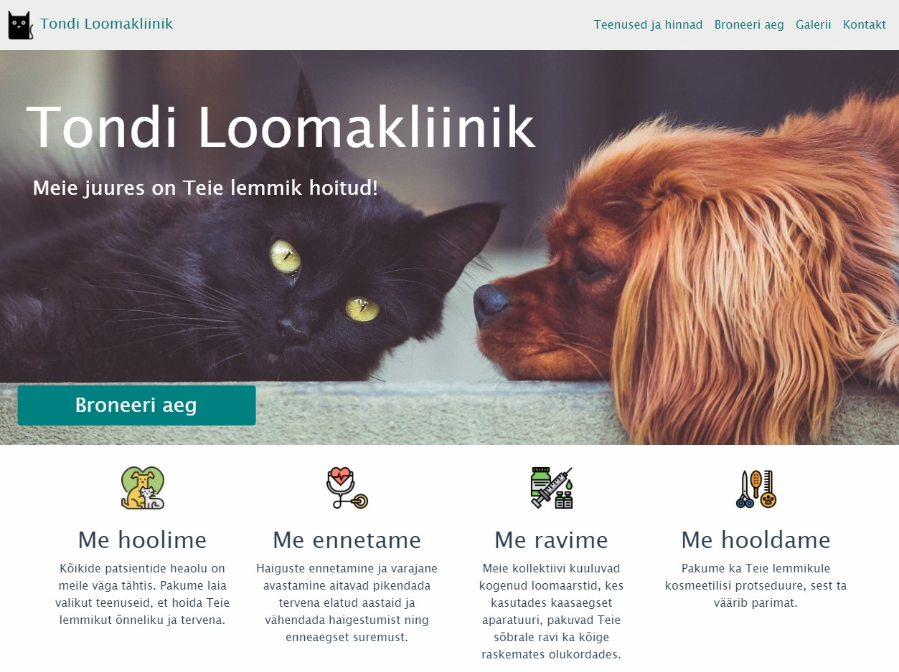
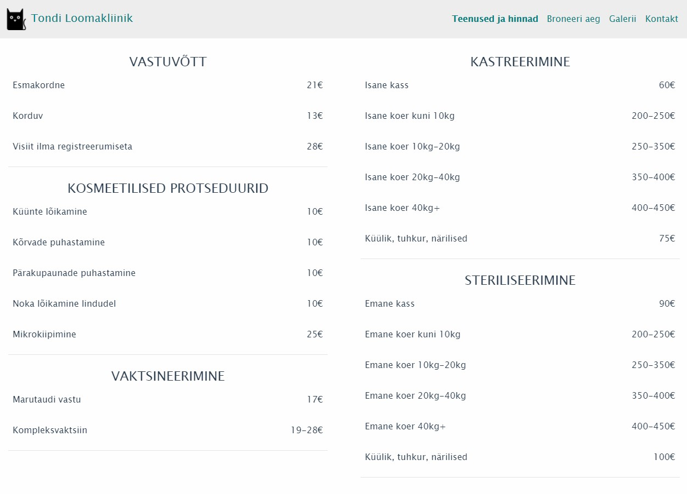
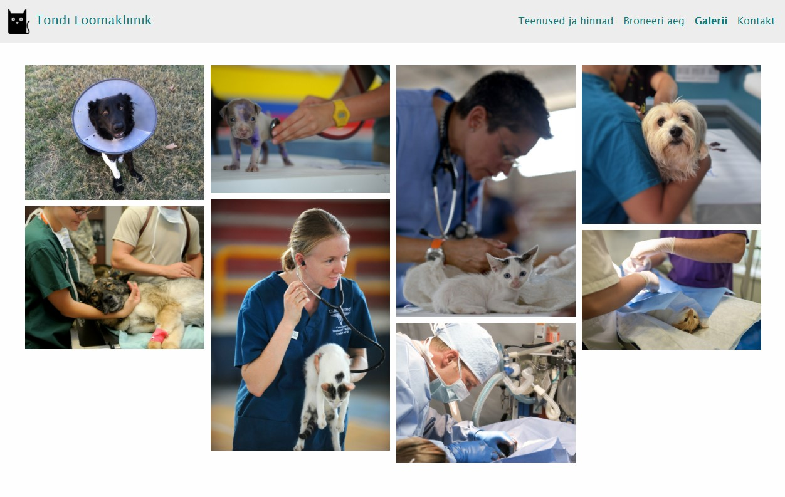
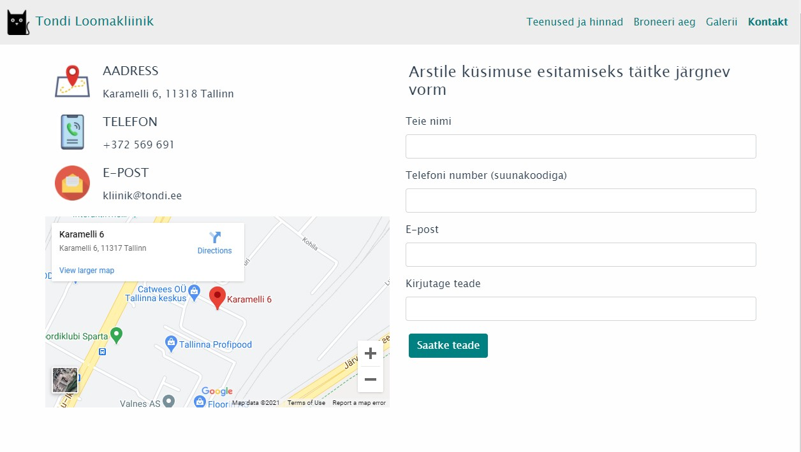
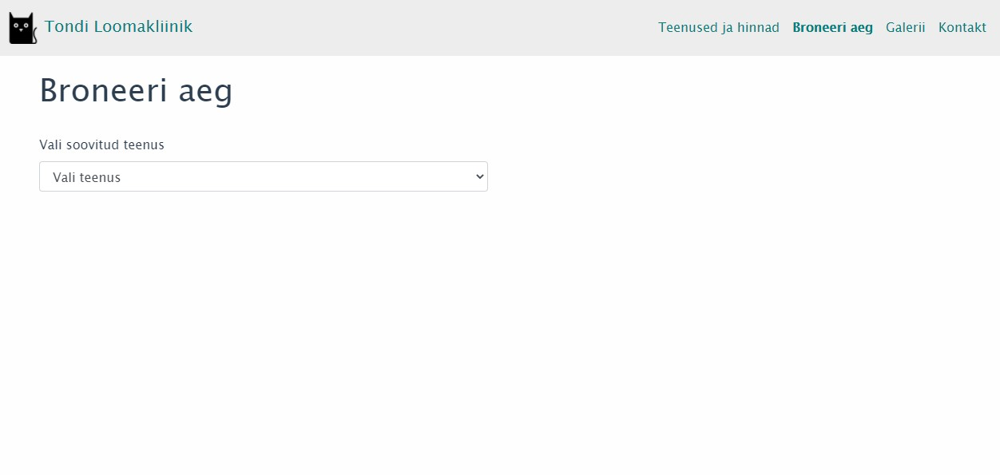
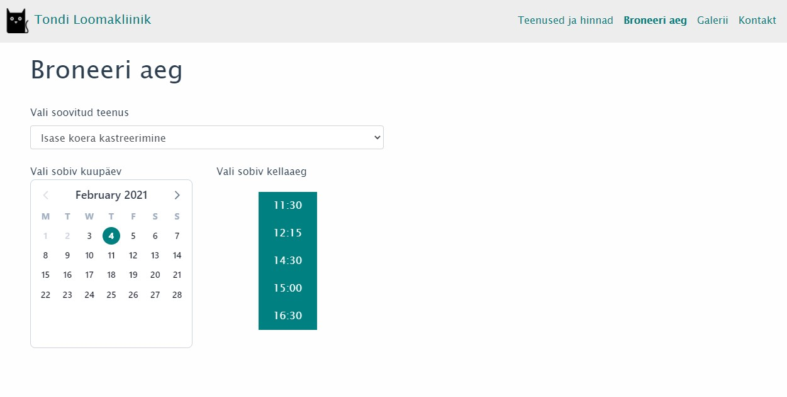
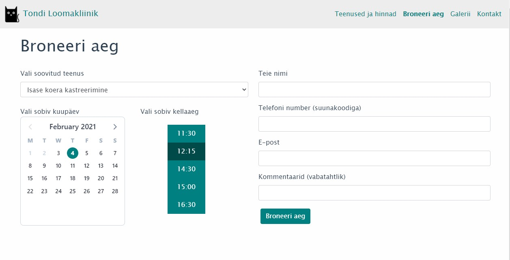
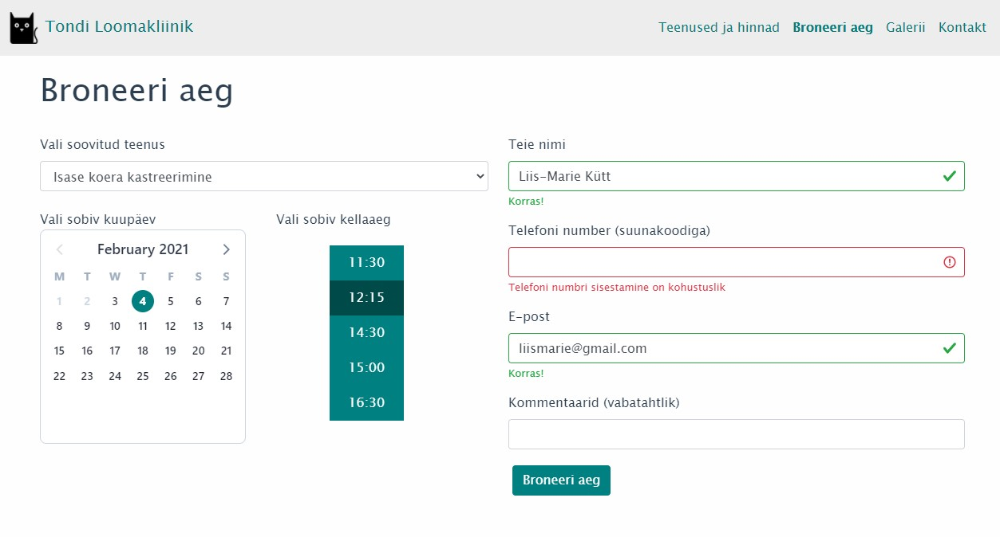
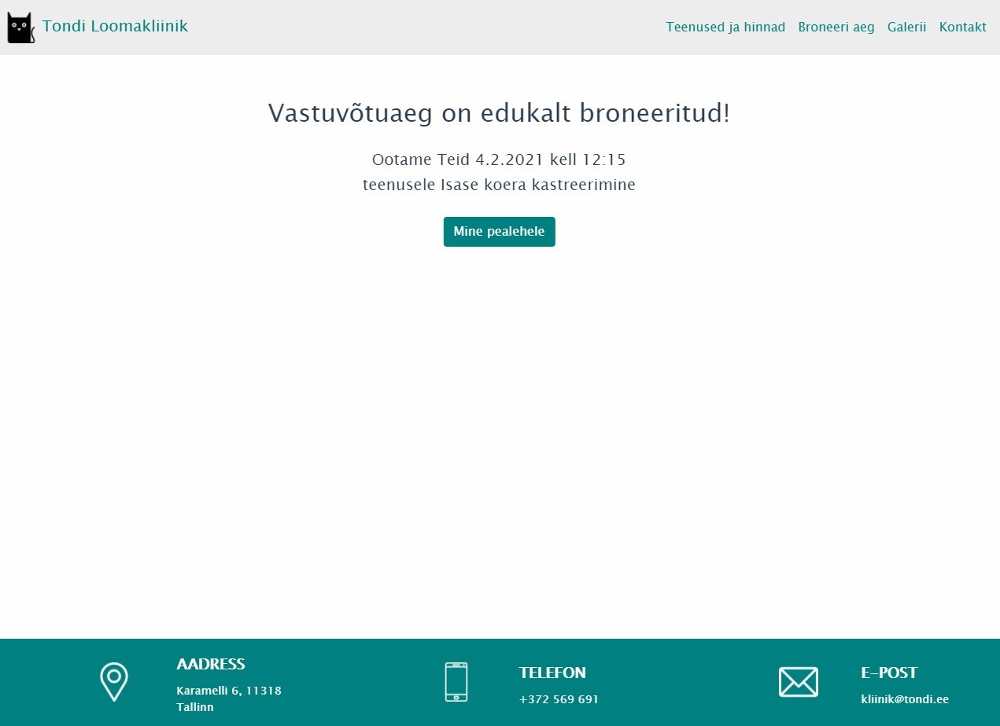

# Animal Clinic

### Web-application for an Animal Clinic.

User can access information about the clinic and book appointment times.
It is possible to see the services which clinic offers with their prices, gallery, contact information and there is a form for forwarding a query.

Application is written using **Vue.js** framework and **BootstrapVue**.
  

Home page |
------------ |
 |

Price list |
------------ |
 |

Gallery |
------------ |
 |

Contact |
------------ |
 |

Booking - Choose service |
------------ |
 |

Booking - Choose time |
------------ |
 |

Booking - Insert contact data |
------------ |
 |

Booking - Contact data validation |
------------ |
 |

Booking - Confirmation page |
------------ |
 |